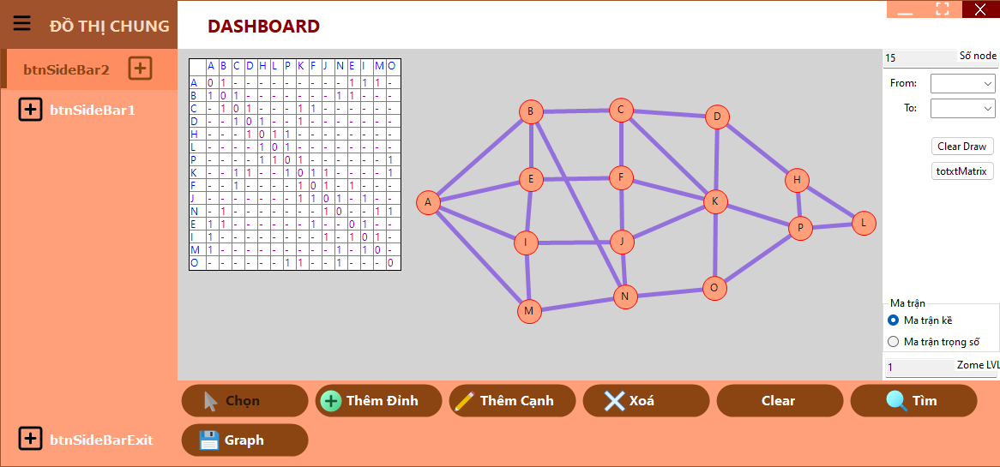

# Lý thuyết đồ thị
![Static Badge](https://img.shields.io/badge/Open_in_Visual_Studio_Code-%23007ACC.svg?style=flat-square&logo=data%3Aimage%2Fpng%3Bbase64%2CiVBORw0KGgoAAAANSUhEUgAAADAAAAAwCAYAAABXAvmHAAAACXBIWXMAAAsTAAALEwEAmpwYAAADv0lEQVR4nO2ZvWsUQRjGZ97VJogfaSSFQbC5bWyUYGMRsbWwsBObgIWFMWBmLid4gtGZBNTOzn9ABEHZGMzsLRo%2FCk935hRUSBELQQIKIrkLEjMyG8479T5mde8L7oEpd%2Bf57b4z88wMQn311VfH5FBxDKhY2sZfPXMfFA%2BjXhIQMQbUXwfqayctNty5ona94suUVzyFshpQNwuoGAcqNoz5cosAKu21ATmQ11tRd0ljTMRstXGoDRC11Nzqsuutjh%2B4pwc67RyhbLAFE3GrlnmoA%2FCrecWV1NzqBNIad8j8vQFMhFfPPDQDqIBk2m8%2BvbgLiHjSyDzYA3xsr%2FnMoyGgvmpmHmwB5oq6febP%2B%2FvMHG9jHloCYAYMD0cQC%2FfGNj8ZHAQiVmzNQ%2BIA194MYq4C4EoDU%2BuYyWl0%2B7Zj86gzKUaB%2BF%2FjmIdEAfibYeDybWS%2BqhkgNJ0famieiuNARCmWeSJKkM6dTgwAuFr803ylyU8Ok0dqPjeZOwPE%2FxHvy4t36LzYb55PDoDJz%2FUBNksKmLxYnVcgLWjcksFE3EF0YUf5HYkBYC4vNwQolxSTD9GVwm5MxPWY5tdMFvqzXzexMaA1xkxdsoEAJktwYTFOySwjIkZqdesmPY0Cl2eByx%2FNIZSG7HMNNNe4ZKh%2FF40HO%2Bv157ZiIQMWngSmvlv9jct5Demg1lf%2FbsZIs77cVq3EDiscBS6%2FWUFcDTVkHlUDfEAkOGTTj9vSKMHDEeDyixWEadnnGhP%2FPpqYH7Ttwm0pABEjkAm%2BRF%2FYEgKz8L5Z0TsO4KQXjgIR36KSyAQarryyhgAuPyCuOldCQMXJaBBWD8opA5G3hzCTACu0fxADyZ2tGw3Suc1Zx%2FpPRAvfXXQjbMc0qjGm%2FqXmi5KBeFGKAwFMLUcRvZUAmPrTVlmG%2Bg%2FRlNiNubweD0KuAVOtixJA%2Fc9NzK8DFRdRNlsJc6xAY0FsxvM7iOeTD3NA%2Fcf1s7v%2FyaF%2B7Tg9o85YRY%2Ff%2F8Y7NFtINk4jujAMRLz9O%2F76gdmkN3rUYeFx4DLeuOCyBKyQ3IYm0sT8oDFcLhkzLtAJyy3lTDgKXH2NW1Ju8uuAxmZzji7M70FxNVM4CFytdBjgPzX7eh8wudS7AEbT%2BSFgUvUugBEr7AKuniQC4LX7aLGsbH4Ac%2Bn9L0DKK051BiCCCLZgrm79E4AXHa%2Bf69zxevWBAZeztgCprrrgqJLJQsDkRgOAbr1iqgi4HIsOybjSDpe9dclXlsPkMeDq%2FfabS0977pq1r75Qd%2Bgnbk39qO0MuGMAAAAASUVORK5CYII%3D&labelColor=%23252526)    ![Static Badge](https://img.shields.io/badge/Open_in_Visual_Studio-%236F2DAB.svg?style=flat-square&logo=data%3Aimage%2Fpng%3Bbase64%2CiVBORw0KGgoAAAANSUhEUgAAADAAAAAwCAYAAABXAvmHAAAACXBIWXMAAAsTAAALEwEAmpwYAAAG%2FklEQVR4nO3YeUyTdxjA8XdbtmVb4pZ4ZFFc5nQ6kRaw1aGicsqpXNZ5Z8uWiQf3RCjQVwQRKVdFKaWaLR4TkXjRlqO0UC6LlKMtbsYtmdkSs0N3SPs2zq3P8rYUykvt%2B9O4FBOe5PsPpf09H3h524BhUzM1U%2BOyKeK0bM8Oqfvz5N5%2BQ7vAdK6zzOCFPS%2Bzx%2F1Lr3j3k4ZPFlXAjkUl0F5uAlUZYW4vJyQqAbESm8yTxrw6L4VRc3efx2nYtVgMJKK9zESJUHaUmoKwyTY469qMDO%2F6W%2Fu9LkMKswZsiIkAa6pS00BHGbETcHhxMiz%2FejaruTuL1QAZS%2BvBHqEqNTmvxNTdxR%2Be5bLlRSzNyzy2ooHHVkAOWw5UhIoOUGqCtlJTnUuWBwxewNmtXx1c1gr4MiU4QqhKCISMBpcAeGxFCbm8LUeItmICKeRDq%2BNuLhFzhk5Wb9TfE8fpRYLQ268%2BzfI4S5lOLkzmDNH2rADVm77xEXP0MjFHbxZzhkC8kUwP1bH67uOcobefbHnFVpytMONsK8AZoo1PIEV7aPZKya8FgUo4Obr8EFSTgDg9iOL0P4k5OhbS8mx5UA5b8dCyvC0niFY%2BgRTtwR%2B5HTNvmlMO%2B9mXBh0AQBSrJ0Qx%2Bs3OXoPLalnOYysM5GJkCIjvW4sIQIkeMEcA1srNmcvrOyYA4vQgjNWZhbG6QtzBm0uGd%2BMCLqvxl2yW3LI8HQJnK9sPe7XPbD1KAEoIgGNga9Nswd95fvJeym8AqizpoDJaKxVxNG%2Fanrvf%2B8rsdO%2F6H7hLGyCL1QR0CN4ypYh8fyCfqzxKAEpPBLAmGK6O03c7AghjLN2q3KBdlLDgzLRExsWBNM8rcMBbAs4QPJbiEY%2BlSLA%2FV1lIAEoIgAqgJtpya4YoVn9rDKCzB8DxqMH7qey6vt3uZyGJcRGcIliKezmsFn%2FqucpnBdjsdhyokV%2Bv5gzOE8Xp7lIBlTE6OBGthYqoQchcIQEahC5redM8R%2BcqjhCA0lMDyBFxtIyqWP0fFsDIT78y2go4HqWFig2DgK%2BVw54l5xwhJPhy2bTHnat4doATQM3%2BcWGc3k8YozVNBAxaAIL1A1AQ2AEJjJoRxGVzupekEMdwpx%2BHFQUEoEQL2OJ2AqhRv0cYrY2qjNb9awVo4USUFXBsBFAeOQBFoWpI9q57mOhxcTvtoRiGtRwmACUEQCVQo35PvPvXG9J96scBKiiAsoh%2BKAnrN%2FLD%2B2LRAEZACQEgBGr2jycxJGsSPa6a4t1rIGd1kwVgu%2F4nACL6gR%2BuMReFaRy%2B6dlPS74RUMLoZqubEKjZHktk1nskM6S%2FJzOkkOhxDXa710Cun8IhoJQEhPdBcXgf8MM0UBSiucgPHnzjcefK842AEgKgCqiRX09gyNySGZIfUxhSIAGjiCU1kBfYZgWstwLKIvsnAkI1cGTdDe2RkOvvOgTkGQGlpwLs%2FeDS9GSm9FtyeVvjEB4X%2FiqN6L15jPzpUwFhVsDRUA0UhvRCwbqe3%2FICr%2FtRz20%2BZASUaAHb5orAvq1uVaYUprQrhSkFS1SEh%2FR20hLJYvIzkSByQGu5%2FimAIjvAkXU34HCQ%2BmFegPrT%2FwlQDWOJ%2Ftm98EJ%2FKlMKZBMQHtLGJM%2FLb9meWxIxMKcscuCOPYBPAkJJQO%2FIb%2BAGHA7ugfxANRwK6BZ9PvJhrjnXCCg9AUBk3vX%2B%2Be5UpsyyvAMEn8OpfYn6fMGGfveyiL775B3I%2FvofBwjqgbxANeQGdEGOX6sq01c2synXCCjRAra%2Fcwq2zRXDZ%2FPPqdIsy9uyASTkJbXT2WuUhg2sKg7vI8YByMuHBARPAEC6r%2FS7poNGQIkWEL%2Bw9k78wtpH5PK2RhEMyd0UhsyH9kUwDCsO00QWh%2Fc9sgGs178VkD8K6IRsPwWkr5ZAE25EivbgZIbkvTRPaWOa5xhgBNGb4lk%2FB3uC4Yf37SgK6zXb%2FwGPAa7DwYBOyFrbAvt9r0EjbkQK%2BfBUpsw71VN2OpUpvZfGkFal%2BNS%2Bhj3FHA3pzR53ByL%2FgIN64JAF0AHctXJIW3UFGnlGpDBXTGFob%2Fl4gBoOBXYDHtAO3DXNkLrq0uQGkJ%2BDCtfdqB13CyUB%2FirIXNMIySvroCHHSJss2zDsEoAFwRl6pSC4p9n%2BDsTzb4OM1Q2QtKIWGnIMKJ13GcCCCFVPyw9S94%2FdQpVwYLUMElfUQEO2gS6FPOOv6S4FWBDBXbPyAtS3R2%2BhvhLY53MOZFmGx9Up4xrXk%2F%2FhxibL5Pl3zsf9O34mb6Ff%2BF6DvR%2BembC4lDvcJMl6sAabrJMb2LWM6yd%2FmLbqMiSsPAsyrsGSNNMgl3GNSG%2BWLh%2Fh9tvbimK6Hwg%2FHvpTkjl8SpY5zHT1TlMzNdhzNv8BrBBGZACZ85YAAAAASUVORK5CYII%3D&labelColor=%23252526)

Demo lý thuyết đồ thị Winform

## *Chạy phần mềm*

Yêu cầu Visual Studio 2022 và .NET 8.0 

## *Các thuật toán*

- DFS
- BFS
- Kruskal
- Prim
- Dijkstra

## *Features*
- Fullscreen mode
- Lưu/Load đồ thị
- Zoom in/out map
- Di chuyển map
- Ma trận kề/trọng số

## *Screenshots*

*Made by Nguyễn Nguyên Vũ*

